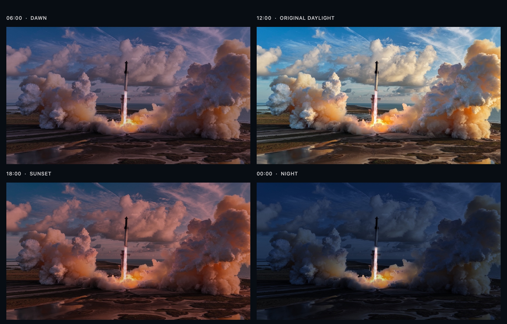

# Starship Dynamic HDR Wallpaper

A launch frozen in place. The light changes with your day.

Native macOS wallpapers made from a SpaceX launch photograph, with dawn, daylight, sunset, and night grades. The original spacecraft and scene stay intact. No image generation, extra app, subscription, or background process.



## Download

**[Download the solar HDR wallpaper — recommended](https://github.com/QuantIntellect/starship-dynamic-wallpaper/releases/latest/download/Launch-Solar-HDR.heic)**

[Preview the full day cycle](https://quantintellect.github.io/starship-dynamic-wallpaper/) · [All downloads](https://github.com/QuantIntellect/starship-dynamic-wallpaper/releases/latest)

| Edition | How it changes | Download |
| --- | --- | --- |
| **Solar HDR** | 16 stages tied to the sun's position; dawn and sunset follow your location and the season. | [HEIC · 69 MB](https://github.com/QuantIntellect/starship-dynamic-wallpaper/releases/latest/download/Launch-Solar-HDR.heic) |
| **Clock HDR** | 24 hourly frames using your Mac's local time; consistent clock-based timing throughout the year. | [HEIC · 95 MB](https://github.com/QuantIntellect/starship-dynamic-wallpaper/releases/latest/download/Launch-Day-Cycle-HDR.heic) |
| **Complete pack** | Both wallpapers, the offline preview, and setup instructions. | [ZIP](https://github.com/QuantIntellect/starship-dynamic-wallpaper/releases/latest/download/Starship-Dynamic-Wallpaper-v1.0.0.zip) |

Each frame is **4096 × 2304** and contains an **ISO HDR gain map plus an SDR base image**. The exhaust reaches up to 4× reference white in the HDR master. Previews here use standard brightness.

## Set it as your wallpaper

1. Download the **Solar HDR** HEIC above and keep it somewhere permanent, such as `Pictures/Wallpapers`.
2. Open **System Settings → Wallpaper → Add Photo → Choose File**, then select the HEIC. If macOS only adds it to Your Photos, click its thumbnail.
3. Choose **Dynamic** from the appearance menu. Enable **Show on all Spaces** if you want it on every desktop Space.

That's it. macOS handles the changing light. You do **not** need to clone this repository or run any scripts.

Use a current macOS release; macOS 15+ is the recommended target for the adaptive HDR format. Older versions and other desktop systems are not verified. HDR brightness depends on the display, available brightness headroom, and whether the wallpaper renderer enables HDR. SDR rendering is included in the same file.

## Which version should I choose?

Choose **Solar** for lighting that follows sunrise and sunset. It uses the same native `apple_desktop:solar` metadata structure as Apple's dynamic landscape wallpapers, with intermediate phases added. macOS uses its location/time-zone information to select the lighting.

Choose **Clock** if you prefer fixed times or the solar timing does not match your location:

| Local time | Look |
| --- | --- |
| 00:00–04:00 | Deep blue night |
| 05:00–07:00 | Predawn, dawn, and sunrise |
| 08:00–09:00 | Morning |
| 10:00–14:00 | Original daylight |
| 15:00–17:00 | Afternoon and golden light |
| 18:00 | Sunset |
| 19:00–21:00 | Twilight into night |
| 22:00–23:00 | Deep blue night |

These times describe the **clock edition**, not the solar edition. macOS controls transition interpolation and refresh timing; minute-exact frame changes are not guaranteed.

## Troubleshooting

- **It stays light or dark:** choose **Dynamic**, rather than Light (Still) or Dark (Still).
- **The old wallpaper returns on another desktop:** enable **Show on all Spaces**.
- **The solar timing looks wrong:** check the Mac's date, time zone, and usual location settings, or use the Clock edition.
- **The HDR effect is subtle:** the display or desktop renderer may be tone-mapping to SDR. The browser preview also uses SDR. HDR does not mean every pixel is made brighter.
- **Finder shows only a single picture:** that's the primary preview image; the HEIC contains the whole day cycle. Add the `.heic` directly in Wallpaper settings instead of exporting a JPEG from Preview.

## What's preserved?

The source photograph's resolution, framing, rocket geometry, launch tower, smoke, clouds, and landscape are preserved. Changes are limited to color, exposure, and selective highlight brightness. This is an HDR enhancement of an SDR JPEG, not a recovery of clipped RAW-camera detail. HEIC encoding uses high-quality lossy compression.

## Build or inspect it yourself

The ready-made downloads are the easiest route. For contributors, the repository includes the original image, native Swift generation tools, and frame-by-frame validation.

**Build requirements:** an Apple silicon Mac, macOS 15+, and Xcode Command Line Tools with a recent Swift compiler. The scripts use only Apple's Foundation, Core Graphics, Core Image, and Image I/O frameworks.

```bash
git clone https://github.com/QuantIntellect/starship-dynamic-wallpaper.git
cd starship-dynamic-wallpaper
./scripts/build.sh
```

The HEIC files and checksums appear in `dist/`. The scripts do not change your wallpaper or system preferences. The light masks are designed specifically for the included launch photo; this is not an automatic converter for arbitrary images. Encoding can vary slightly between macOS versions, so rebuilds are not promised to be byte-identical to the release.

Validate downloaded files on macOS:

```bash
./scripts/verify.sh ~/Downloads/Launch-Solar-HDR.heic
```

Or verify download integrity from the release directory:

```bash
shasum -a 256 -c SHA256SUMS.txt
```

See [verification details](docs/verification.md) for the checks and their limits.

## Credits and license

Photograph credited to **[SpaceX](https://x.com/SpaceX)**. Wallpaper grading, HDR treatment, and packaging by **[QuantIntellect](https://github.com/QuantIntellect)**. [Image attribution and rights](IMAGE-CREDITS.md).

Source code and documentation: [MIT](LICENSE). The image assets are excluded from that license. This is an independent project with no SpaceX or Apple affiliation.

Technical references: [Apple wallpaper setup](https://support.apple.com/en-bh/guide/mac-help/mchlp3013/mac), [Apple Adaptive HDR](https://developer.apple.com/videos/play/wwdc2024/10177/), and [wallpapper's dynamic HEIC metadata reference](https://github.com/mczachurski/wallpapper).
